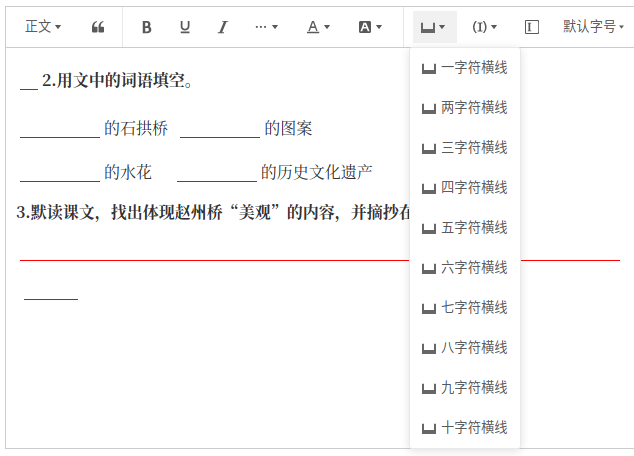
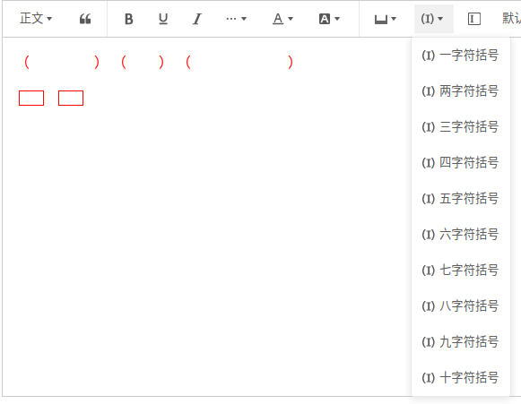

# wangEditor 填空题空格

# 介绍

[wangEditor](https://www.wangeditor.com/) 插入填空题空格插件，支持直接在题干上输入答案。有长空格和短空格两种长度





## 安装

```shell
npm install wangeditor-plugin-fillinblank -S
or
yarn add wangeditor-plugin-fillinblank -S
```

## 例子
[demo1](https://github.com/Black-Jacki/wangEditor-plugin-fillinblank/tree/master/examples/demo1)

[demo2](https://github.com/Black-Jacki/wangEditor-plugin-fillinblank/tree/master/examples/demo2)

## 使用

### 注册到编辑器

如果你使用的是script标签方式引入，会在全局挂载一个fillInBlank变量供使用
```js
// 注册。要在创建编辑器之前注册，且只能注册一次，不可重复注册。
wangEditor.Boot.registerModule(fillInBlank);
```

如果你使用npm
```js
import { Boot, IEditorConfig, IToolbarConfig } from "@wangeditor/editor";
import fillInBlank from "wangeditor-plugin-fillinblank";

// 注册。要在创建编辑器之前注册，且只能注册一次，不可重复注册。
Boot.registerModule(fillInBlank)
```

### 配置

```js
// 编辑器配置
const editorConfig: Partial<IEditorConfig> = {
  // editorConfig...
}

// 工具栏配置
const toolbarConfig: Partial<IToolbarConfig> = {
  insertKeys: {
    index: 0,
    keys: [
      {
        key: "group-fill-blank",
        title: "填空空格",
        iconSvg: fillInBlank.icon.ICON_SVG,
        menuKeys: [
          "insertFillBlank1",
          "insertFillBlank2",
          "insertFillBlank3",
          "insertFillBlank4",
          "insertFillBlank5",
          "insertFillBlank6",
          "insertFillBlank7",
          "insertFillBlank8",
          "insertFillBlank9",
          "insertFillBlank10",
        ],
      },
      {
        key: "group-fill-blank-paren",
        title: "填空空格",
        iconSvg: fillInBlank.icon.ICON_PAREN_SVG,
        menuKeys: [
          "insertFillBlankParen1",
          "insertFillBlankParen2",
          "insertFillBlankParen3",
          "insertFillBlankParen4",
          "insertFillBlankParen5",
          "insertFillBlankParen6",
          "insertFillBlankParen7",
          "insertFillBlankParen8",
          "insertFillBlankParen9",
          "insertFillBlankParen10",
        ],
      },
      "insertFillBlankRect1",
    ], // “插入”菜单
  },
  // 其他...
}
```

然后创建编辑器和工具栏，会用到 `editorConfig` 和 `toolbarConfig` 。具体查看 wangEditor 文档。

### 显示 HTML

空格获取的 HTML 格式如下

```html
<!--横线空格-->
<input data-w-e-type="fill-blank" width="72px" index="0" shape="line">

<!--括号空格-->
<span style="color: rgb(255, 0, 0);">（</span><input data-w-e-type="fill-blank" width="72px" index="0" shape="paren"><span style="color: rgb(255, 0, 0);">）</span>

<!--矩形框空格-->
<input data-w-e-type="fill-blank" width="28px" index="0" shape="rect">
```
index 表示这个空格在编辑器里的位置，按从左到右，从上到下的顺序依次累加

获取到的是纯html，展示文本时可自定义样式，具体可参考 [wangEditor自定义样式](https://www.wangeditor.com/v5/content.html#%E8%87%AA%E5%AE%9A%E4%B9%89%E6%A0%B7%E5%BC%8F) 